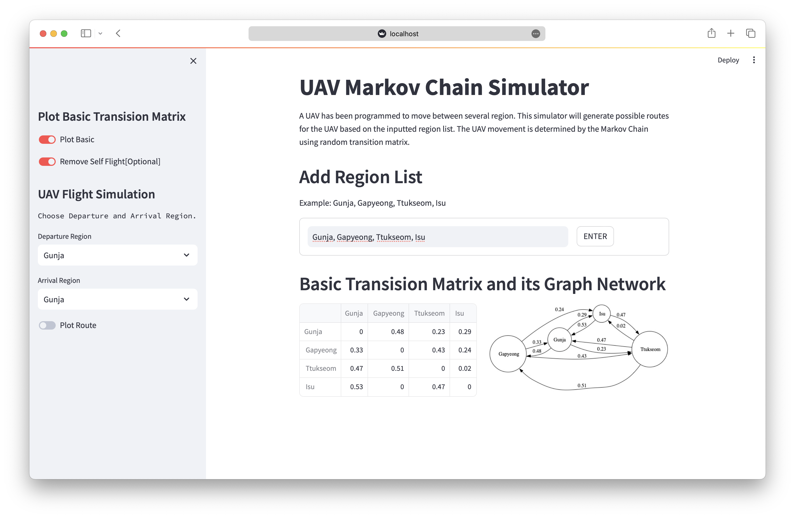

# UAV Route Simulator using Markov Chains

This repo contains:
- `markovchain.ipynb`: 

   A Jupyter notebook that demonstrates the use of Markov Chains to simulate the movement of a UAV.
   The user can upload their own data and run the simulation.
   This repository contains an example file (`./data/example.csv`) that can be used as a transition matrix.

   Using the example data, the user will simulate a use case as follows:

   A UAV has been programmed to move between several regions. The regions are Gunja, Gapyeong, Ttukseom, and Isu.
   This notebook shows the possible routes for the UAV, starting from Gunja and ending in Isu without taking a direct flight.

- `streamlitmc.py`: 
   A web based app that demonstrates the use of Markov Chain to simulate the movement of a UAV.
   The user could generate random data to simulate the movement of a UAV.

## How to run the web app simulator
- Clone this repo.
- Install the requirements by `pip install -r requirements.txt`.
- Run `streamlit run streamlitmc.py` in terminal.

## How to use the web app simulator

1. Enter several regions as a comma separated list. (e.g. `Gunja,Gapyeong,Ttukseom,Isu`). This step will generate a random transition matrix. 
Turn on `Plot Basic` to see the generated transition matrix and its graph network. 

2. [Optional] Turn on `Remove Self Flight` to prevent the UAV from staying in a region.

3. Select Departure and Arrival Region and turn on `Plot Route`. This step will
generate a new random transition matrix and 
automatically remove the direct connection between departure and arrival region.

4. Click on `Simulate` to see the route of the UAV from departure region to arrival region.

5. Scroll down to see the plot of probability ending
in arrival region in N-step.

# Acknowledgement

Thanks to [this repo](https://github.com/ad17171717/YouTube-Tutorials/blob/main/Statistics%20with%20Python/An_Intro_to_Markov_chains_with_Python!.ipynb) for the inspiration.
